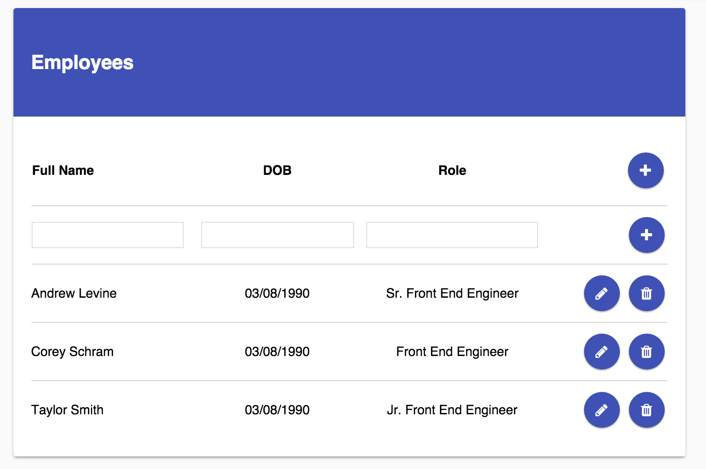

# OnPrem Front End Assignment

Using the API provided in this repository, create a client-side application that can be used to add/edit/remove employees from the faux employee database.

## Rules/Guidelines
- Unless previously agreed upon you *should not* use frameworks (Angular/Ember/Backbone/etc)
- *Can* use libraries (React/Redux/Ramda/etc)
- *Can* use CSS Preprocessor (SASS/Less/Stylus/PostCSS/etc)
- *Can* use any DOM APIs/CSS/JavaScript features that are supported in the latest stable versions of Chrome *and* Firefox
- The UI of your finished application should match the included screen-shot
- *Can* use the [Font-Awesome](https://fortawesome.github.io/Font-Awesome/) icon font to match icons from the provided mockup
- Your finished application should visually look as close as possible to the provided mockup
- *Can* use TypeScript
- JavaScript must be strict-mode compliant (`'use-strict';`)

## What We're Looking For
The following are our primary areas of focus when reviewing your work:

- Modularity/Extensibility
- Readability
- Common Front End Best Practices
- Attention to detail

These should not be surprising, as they should also be your focus building any app :).

## Optional Tools
The following tools are entirely optional (and not included or configured in the repository), but you are welcome to use any that you find necessary.

- ES2015/2016 Transpiler (Babel)
- Module Bundler (Browserify/Webpack/Require/etc)
- Build System/Task Runner (Gulp/Grunt/npm "run" scripts)

## Prerequisites
- node.js version >= `4.0.x`

## Getting Started
1. Clone the repository
2. Run `npm install` in the root of the repository

## Starting/Using the API
1. Run `npm run local`
2. The API will be available at `http://localhost:3000/employees`

### Endpoints
- `GET`: `/employees`
    - Returns an array of all employees
- `POST`: `/employees`
    - Add a new employee
    - Request body should be an employee object (see src/db/employee-data.json for example)
- `PATCH`: `/employees/{id}`
    - Edit an employees details
- `DELETE`: `/employees/{id}`
    - Delete an employee

## Writing your Client-Side App
The entry point to the application is `client/index.html`, and can be accessed from `http://localhost:3000`. You can add any files/directories you need in the `client` directory, using the folder structure of your preference. All static assets in `client` are served by the same server that is started when you run the API.

## The workflow for submission:
1. Create a branch, using a branch name you feel is appropriate.
2. Once you're satisfied with your solution, create a pull request against _master_
